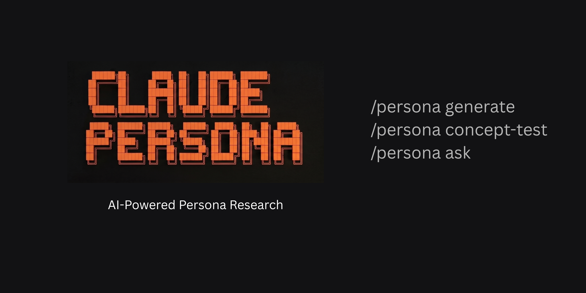

# claude-persona

[](https://claude.ai/claude-code)
[](requirements.txt)
[](LICENSE)

Claude Code skill inspired by
[TinyTroupe](https://github.com/microsoft/TinyTroupe). It generates diverse
AI persona panels, runs agent-separated concept interviews, and delivers
structured research reports in one flow.


## Who This Is For
- Marketers who need fast qualitative signal before paying for fieldwork
- Product managers testing concepts, messaging, packaging, or feature bundles
- Marketing data scientists, UX researchers, and strategy teams who want a reusable synthetic audience panel

## Quick Start
### Install

```bash
/plugin marketplace add takechanman1228/claude-persona
/plugin install claude-persona@claude-persona
```
Restart Claude Code after installation.

<details>
<summary>Alternative: One-command install (curl)</summary>

```bash
curl -fsSL https://raw.githubusercontent.com/takechanman1228/claude-persona/main/install.sh | bash
```

</details>

### Run a Study

**Step 1 — Build a persona panel**

```
/persona generate 10 Gen Z skincare shoppers in the US
```

10 diverse personas spanning different skincare attitudes:

| Name | Age | Segment |
|------|-----|---------|
| Mia Nakamura | 22 | Routine Devotee |
| Tyler Kowalski | 19 | Skincare Skeptic |
| Sofia Gutierrez | 26 | Budget Beauty Maven |
| ... | | |

[Full panel (10 personas)](demo/genz-skincare/README.md#step-1-build-panel)

Other examples: `Moms with babies shopping for strollers in the US`,
`High income travelers choosing luxury hotels in Europe`,
`10 first-time meal kit subscribers in France, based on: 38% dual income couples, 27% families with young children`

**Step 2 — Explore motivations (optional but recommended)**

```
/persona ask What frustrates you most about choosing skincare products?
```

Top themes surfaced:
- Hidden ingredient concentrations and unverifiable efficacy claims
- Greenwashing disguised as clean beauty
- Too many choices, too much marketing noise
- TikTok hype vs. real results
- Overpriced basics with a prestige tax on identical ingredients

**Step 3 — Run a concept test**

```
/persona concept-test Compare 3 skincare concepts for Gen Z.

A: Acne Control Serum — fights breakouts with clinically proven actives
B: Barrier Repair Cream — strengthens skin barrier, reduces redness
C: Glow Boosting Toner — everyday radiance, brightens skin tone
```

Results:
- **B: Barrier Repair Cream** — 4/10 (40%) first choice
- **A: Acne Control Serum** — 3/10 (30%) first choice
- **C: Glow Boosting Toner** — 3/10 (30%) first choice
- **Purchase likelihood**: mean 3.3/5, range 2–5

No clear majority — each concept appeals to a distinct attitudinal cluster.
Barrier repair won among ingredient-conscious personas. Glow toner pulled
trend-chasing personas. Acne control attracted problem-driven skeptics.

See the [full demo with verbatims](demo/genz-skincare/README.md).


## Demos

The repository ships four complete demos with pre-generated personas and full results.

- [Demo: Gen Z Skincare Concept Test](demo/genz-skincare/README.md) — 10 personas, 3 skincare concepts
- [Demo: Running Shoes Concept Test](demo/running-shoes/README.md) — 15 personas, 3 shoe concepts
- [Demo: France Meal Kit Concept Test](demo/france-mealkit/README.md) — 10 personas, France market, based on existing customer data
- [Demo: Japan AI Meeting Notes SaaS](demo/japan-meeting-ai/README.md) — 10 personas, B2B SaaS, Japan market


## Installation Details

- Claude Code CLI or Desktop
- Python 3.10+
- `pandas`, `matplotlib`, and `seaborn` for the analysis pipeline


## Documentation

- [Installation](docs/INSTALLATION.md)
- [Commands](docs/COMMANDS.md)
- [Troubleshooting](docs/TROUBLESHOOTING.md)
- [Architecture](docs/ARCHITECTURE.md)

## Project Structure

```text
claude-persona/
├── SKILL.md
├── README.md
├── CHANGELOG.md
├── .claude-plugin/
├── assets/
├── docs/
├── scripts/
├── references/
├── templates/
├── demo/
│   ├── running-shoes/
│   ├── genz-skincare/
│   ├── france-mealkit/
│   └── japan-meeting-ai/
├── personas/
├── tests/
└── outputs/
```


## How It Compares to TinyTroupe

`claude-persona` is inspired by [TinyTroupe](https://github.com/microsoft/TinyTroupe) but takes a different approach.

|  | TinyTroupe | claude-persona |
|--|-----------|----------------|
| **Setup** | Python library + OpenAI API key | Claude Code skill — no extra API key needed |
| **Interface** | Write Python code (define agents, call functions, manage execution order) | Natural language commands (`/persona generate ...`, `/persona concept-test ...`) |
| **Focus** | General-purpose agent simulation | Marketing research: concept tests, messaging tests, packaging, feature bundles |

If you're a Claude Code user who wants to run quick concept research without writing code or managing a separate API key, `claude-persona` is the faster path.

## License

MIT
