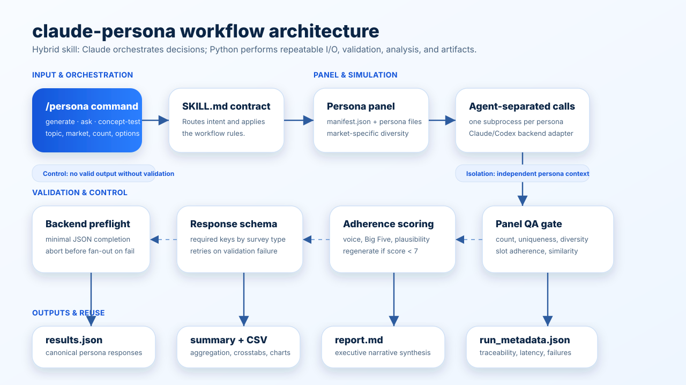

# Architecture

`claude-persona` is a hybrid skill: Claude handles orchestration and reporting,
while Python owns repeatable file I/O, aggregation, charts, and schema checks.

## Workflow

## Runtime Pieces

| File | Role |
|------|------|
| `SKILL.md` | user-facing orchestration contract for `/persona` |
| `scripts/simulate_survey.py` | loads personas, builds prompts, runs independent subprocesses, validates responses |
| `scripts/analyze_results.py` | normalizes responses, writes summaries, charts, CSVs, and reports |
| `scripts/llm_backends.py` | backend abstraction for `claude-cli` and `codex-cli` |
| `references/*.md` | prompt rules, schemas, and report templates |
| `templates/*.md` | survey-type-specific question flows |

## Differentiator

The core product claim is not just "AI personas." It is the execution model:

- one persona per subprocess
- context isolation per subprocess (`--safe-mode`): the user's CLAUDE.md,
  plugins, and hooks never enter persona context
- server-validated structured output (`--json-schema`) with text-extraction
  fallback, plus per-response validation
- optional adherence scoring across four axes
- deterministic summary artifacts alongside narrative output, with cost and
  exact serving-model attribution in `run_metadata.json`

New CLI flags are capability-detected at runtime (`claude --help` probed once
per process), so the engine runs unchanged on older Claude Code versions.

That is why the skill can ship both `report.md` for humans and `results.json`
for downstream reuse.
